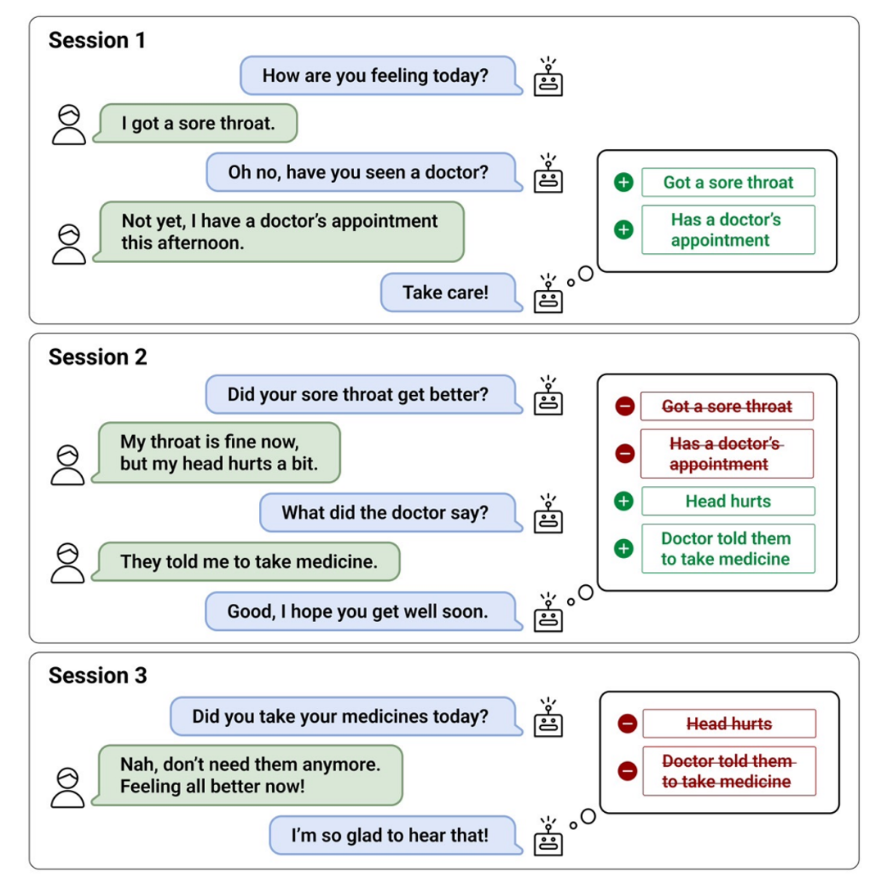

# CareCall Memory

This repository contains CareCall-Memory dataset. It is the first Multi-Session Open-Domain Dialogue in Korean! For more details, please check our findings of EMNLP 2022 paper!

> Title: [Keep Me Updated! Memory Management in Long-term Conversations](https://arxiv.org/abs/2210.08750) <br>
> Authors: [**Sanghwan Bae**](#), [Donghyun Kwak](#), [Soyoung Kang](#), [Min Young Lee](#), [Sungdong Kim](#), [Yuin Jeong](#), [Hyeri Kim](#), [Sang-Woo Lee](#), [Woomyoung Park](#), [Nako Sung](#) <br>
> **In Findings of EMNLP 2022**.


## Overview

<div align="center">
    
    <p>[Figure 1. An example of a long-term dialogue in Carecall-Memory.]</p>
</div>


## Carecall Memory dataset


### Data Format

List of k number of Multiple Dialogue Sessions (k = 2~5)
- **guid**: unique identifier of each dialogue (interactive-$DATA_INDEX-S$SESSION_INDEX)
- **dialogue**: List of utterances
  - **role**: system(CareCall) or user(Senior citizens)
  - **text**: utterance string
- **memory**: Updated fresh memory about the user until the last session
- **summary**: New information about the user obtained from the current session

The dataset is built by following procedures: <br>

1. Train dialogue summarizer and memory-grounded response generator using dataset from previous step
2. Collect Human-Bot dialogues for **5 sessions per episode**, starting from the first session.
  - The interval between sessions is assumed to be from **1 to 2 weeks**
  - At the end of each session, the summarizer generates corresponding summaries from the current session
3. Human validation for the newly generated summaries and dialogues

* Please see Section 3.1, 3.2, and 3.2.2 in the paper for more details.

```
[
 {
  'guid': 'interactive-68-S1',
  'dialogue': [{'role': 'system', 'text': '어르신 안녕하세요, 행정복지센터에서 안부전화 드렸습니다.'},
               {'role': 'user', 'text': '여보세요?'},
               {'role': 'system', 'text': '지금 통화해도 괜찮으세요?'},
               {'role': 'user', 'text': '말씀하세요.'},
               {'role': 'system', 'text': '요즘 어떻게 지내세요?'},
               {'role': 'user', 'text': '평범하게 지내긴 해요.'},
               {'role': 'system', 'text': '특별한 일은 없으셨나요?'},
               {'role': 'user', 'text': '요즘 노인정을 자주 나가요.'},
               {'role': 'system', 'text': '그러시군요. 혹시 불편하신 점은 없으세요?'},
               {'role': 'user', 'text': '지금 이가 아파서 치과에 다니고 있어요.'},
               {'role': 'system', 'text': '아이고, 많이 아프시겠어요. 치료는 잘 받고 계신가요?'},
               {'role': 'user', 'text': '네.'},
               {'role': 'system', 'text': '빨리 나으시길 바랄게요.'},
               {'role': 'user', 'text': '네.'},
               {'role': 'system', 'text': '식사는 하셨어요?'},
               {'role': 'user', 'text': '먹으려고요.'},
               {'role': 'system', 'text': '뭐 드실 예정이세요?'},
               {'role': 'user', 'text': '노인정 가서 같이 해먹어야 할텐데.'},
               {'role': 'system', 'text': '그러시군요. 혼자 드시기엔 입맛이 없으실 것 같아요.'},
               {'role': 'user', 'text': '같이 먹으면 맛있죠.'},
               {'role': 'system', 'text': '네, 맛있게 드세요.'},
               {'role': 'user', 'text': '네.'},
               {'role': 'system', 'text': '네! 그럼 나중에 또 연락 드리겠습니다. 감사합니다'}],
  'memory': [],
  'summary': ['노인정에 다니심', '이가 아파서 치과에 다니고 있음', '식사를 하실 예정']
  },
 ...
 {
  'guid': 'interactive-68-S3',
  'dialogue': [{'role': 'system', 'text': '어르신 안녕하세요, 행정복지센터에서 안부전화 드렸습니다.'},
               {'role': 'user', 'text': '예.'},
               {'role': 'system', 'text': '네, 지금 통화 괜찮으세요?'},
               {'role': 'user', 'text': '괜찮아요.'},
               {'role': 'system',
                'text': '선생님, 저번에 이가 아프시다고 하셨는데, 지금은 좀 어떠세요?'},
               {'role': 'user', 'text': '이제는 많이 나았어요.'},
               {'role': 'system', 'text': '정말 다행이네요. 오늘 식사는 노인정에서 하시는 거예요?'},
               {'role': 'user', 'text': '네.'},
               {'role': 'system', 'text': '맛있게 드시고 오세요.'},
               {'role': 'user', 'text': '그럴게요.'},
               {'role': 'system', 'text': '혹시 불편하신 점은 없으신가요?'},
               {'role': 'user', 'text': '오늘은 눈이 좀 침침하네요.'},
               {'role': 'system', 'text': '안과에 한번 가보시는게 좋을 것 같아요.'},
               {'role': 'user', 'text': '그냥 날이 가물어서 그런가봐요.'},
               {'role': 'system', 'text': '아, 그러셨군요. 오늘 기분은 어떠세요?'},
               {'role': 'user', 'text': '좋아요.'},
               {'role': 'system', 'text': '다행이네요. 앞으로도 계속 건강하시길 바랄게요.'},
               {'role': 'user', 'text': '감사합니다.'},
               {'role': 'system', 'text': '네, 오늘은 이만 들어가볼게요! 통화해주셔서 감사합니다'}],
  'memory': ['노인정에 다니심', '이가 아파서 치과에 다니고 있음', '잘 주무심', '노인정에서 식사를 하실 예정'],
  'summary': ['노인정에 다니심', '이가 아팠으나 많이 나아진 상태', '눈이 침침함', '노인정에서 식사하실 예절']
  },
  ...
 {
  'guid': 'interactive-68-S5',
  'dialogue': [{'role': 'system', 'text': '어르신 안녕하세요, 행정복지센터에서 안부전화 드렸습니다.'},
               {'role': 'user', 'text': '네.'},
               {'role': 'system', 'text': '네, 지금 통화 괜찮으세요?'},
               {'role': 'user', 'text': '네.'},
               {'role': 'system',
                'text': '선생님, 지난번에 눈이 침침하다고 하셨는데, 지금은 좀 어떠세요?'},
               {'role': 'user', 'text': '오늘은 멀쩡하네요.'},
               {'role': 'system', 'text': '다행이네요. 혹시 불편하신 점은 없으세요?'},
               {'role': 'user', 'text': '없어요.'},
               {'role': 'system', 'text': '정말 다행이네요. 앞으로도 계속 건강하시길 바랄게요.'},
               {'role': 'user', 'text': '네.'},
               {'role': 'system', 'text': '혹시 불편하신 점 있으시면 언제든지 말씀해주세요.'},
               {'role': 'user', 'text': '그럴게요.'},
               {'role': 'system', 'text': '어제 잠은 잘 주무셨나요?'},
               {'role': 'user', 'text': '잘 잤어요.'},
               {'role': 'system', 'text': '다행이네요. 오늘 식사는 하셨어요?'},
               {'role': 'user', 'text': '네.'},
               {'role': 'system', 'text': '뭐 드셨어요?'},
               {'role': 'user', 'text': '잔치국수 해먹었어요.'},
               {'role': 'system', 'text': '오, 맛있으셨겠어요.'},
               {'role': 'user', 'text': '네.'},
               {'role': 'system', 'text': '오늘 하루는 어떻게 보내실 예정이세요?'},
               {'role': 'user', 'text': '사람들이랑 같이 산보나 가려고요.'},
               {'role': 'system',
                'text': '아, 그러셨군요. 아 혹시 요새 입맛이 없다거나 하시진 않으세요?'},
               {'role': 'user', 'text': '아뇨.'},
               {'role': 'system', 'text': '다행이네요. 그럼 오늘 통화는 여기서 마쳐도 될까요?'},
               {'role': 'user', 'text': '네.'},
               {'role': 'system', 'text': '네, 오늘은 이만 들어가볼게요! 통화해주셔서 감사합니다'}],
  
  'memory': ['노인정에 다니심', '눈이 침침함', '이가 아팠으나 다 나음', '잘 주무심', '노인정에서 식사를 하실 예정'],
  'summary': ['눈이 침침했으나, 오늘은 괜찮음', '잘 주무심', '식사를 잘 하심']
  }
]
```
* You can find sample dataset at `data/carecall-memory-sample.json`

### Data Statistics

|Session| # dialogue|
|--- | --- |
|Session 1| 770 |
|Session 2| 756 |
|Session 3| 743 |
|Session 4| 674 |
|Session 5| 638 |
|All| 3,581 |


### Dataset License and Download

```
To all the data distributed here(hereinafter, “MATERIALS”), the following license(hereinafter, “LICENSE”) shall apply.

1. You are allowed to use the MATERIALS ONLY FOR NON-COMMERCIAL AI(Artificial Intelligence) RESEARCH AND DEVELOPMENT PURPOSES – ANY KIND OF COMMERCIAL USE IS STRICTLY PROHIBITED.
2. You should USE THE MATERIALS AS THEY WERE PROVIDED – ANY KIND OF MODIFICATION, EDITING AND REPRODUCTION TO DATA IS STRICTLY PROHIBITED.
3. You should use the MATERIALS only by/for yourself. You are NOT ALLOWED TO COPY, DISTRIBUTE, PROVIDE, TRANSPORT THE MATERIALS TO ANY 3RD PARTY OR TO THE PUBLIC including uploading the MATERIALS to internet.
4. You should clearly notify the source of the MATERIALS as “NAVER Corp.” when your use the MATERIALS.
5. NAVER Corp. DOES NOT GUARANTEE THE ACCURACY, COMPLETENESS, INTEGRITY, QUALITY OR ADEQUACY OF THE MATERIALS, THUS ARE NOT LIABLE OR RESPONSIBLE FOR THE MATERIALS PROVIDED HERE.
```

#### Original carecall-memory dataset (in Korean)

* Please be aware of the above license.
* **TR;DL**: `carecall-memory` dataset is available for only non-commercial usage, i.e., please use it for research purposes.
* To download our original dataset in Korean, please fill out [this form](https://naver.me/5zovK7N5) first.

#### Automatic machine-translated dataset (in English)

To promote more variety usage of our dataset, we release machine-translated version, too. <br>
It has the same statistics as the original. <br>
For this, we utilize internal ko-en machine translation engine powered by [Papago](https://papago.naver.com/). <br>
**(WARNING!)** Even though we inspect mis-translation errors by random sampling, It still contains lots of translation noise/errors. <br>
We always welcome your contribution of thorough correction of the errors.

* The machine-translated version can be found at `data/carecall-memory_en_auto_translated.json`. <br>
* It does not require applying form different from the original Korean dataset.


## Citation


```bibtex
@inproceedings{bae2022updated,
      title={Keep Me Updated! Memory Management in Long-term Conversations}, 
      author={Sanghwan Bae and Donghyun Kwak and Soyoung Kang and Min Young Lee and Sungdong Kim and Yuin Jeong and Hyeri Kim and Sang-Woo Lee and Woomyoung Park and Nako Sung},
      booktitle={Findings of the Association for Computational Linguistics: EMNLP 2022},
      year={2022}
}
```

## Contact

If you any questions for our dataset, please contact to Sangwhan Bae (sanghwan.bae@navercorp.com) or Sungdong Kim (sungdong.kim@navercorp.com).

